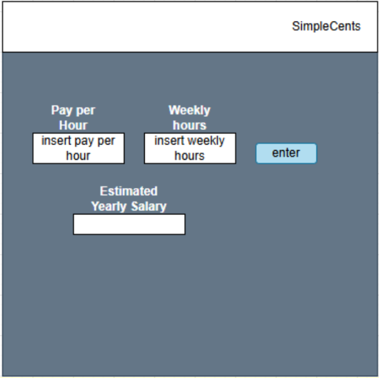

# Deliverable 2

## Positioning

### Problem Statement

The problem of poor money management affects young adults and college students; the impact of which is not having enough money for necessities or savings and falling into debt.

### Product Position Statement

For young adults and college students who are in debt or have poor money management skills, SimpleCents is a money management website that helps those young adults find ways to manage their finances in order to get rid of debt and start saving. Unlike Rocket Money, our product offers a signup-free download-free website.

### Value Proposition and Customer Segment

Simple Cents is a finance website that helps young adults manage their finances with ease by providing a simple , intuitive budgeting platform that tracks spending and helps them stay on top of their financial goals.

Young adults (ages 18-24), primarily those with moderate to low incomes, who want to take control of their finances by tracking their spending, managing essentials, and setting financial goals. They seek a simple, intuitive tool to help them stay on track with their budgets and reduce their financial stress.

## Stakeholders

* Young Adults & College Students (Ages 18-24) 
    * The main users of SimpleCents who need help managing their finances, tracking expenses, and reducing debt. 
    * Use the platform to track income, spending, and savings.
* Part-Time & Full-Time Workers (Ages 18-24) 
    * Young adults who work while attending college or have recently started full-time employment and need financial tracking tools. 
    * Utilize the platform to manage paychecks and financial goals.
* Employers of Young Adults
    * Businesses employing young adults who may struggle with financial stability. 
    * Recommend the platform as a financial wellness tool for employees.
* Universities & Student Support Services 
    * Colleges and student organizations focused on financial wellness for students. 
    * Potentially integrate SimpleCents into student financial aid or support programs.
* Budgeting Focused Web apps and Mobile apps
    * Companies or projects that offer a similar service of creating budgets for users.
    * Potentially use SimpleCents as a framework for their product.

## Functional Requirements

* Calculate estimated annual salary
* Show a breakdown of the user’s spending habits, potentially in a graph.
* Calculate the minimum payments for user’s in debt.
* Calculate potential savings amount for user.
* Financial Wellness Guide on how to build credit, save money, etc.
* Use all these calculations to create a csv document that the user can download in order to keep track of what their budget should be.
* User can upload that same csv document as a “login” so that the web app can update each calculation with new information or changed information from the user.

## Non-Functional Requirements

Speed
* Importance:  it is important that the users are able to insert input and receive an output in a timely manner.
* Verifiability: The systems response time should be 0.5 seconds or less for 90% of normal user interactions

Scalability
* Importance:  we want our website to be able to work well on phones, laptops, ipads etc.
* Verifiability: The system should be available for at least 80% of commonly used devices and browsers.

Reliability
* Importance:  Our website should provide consistent and reliable results.
* Verifiability: The system should have a 95% uptime over a year and will be able to handle at least 1000 users at the same time without failure

Usability
* Importance:  Our website should be intuitive to use and easy to understand.
* Verifiability: At least 90% of test users should be able to use the website without help

Optimization
* Importance: Our website should have no issues running on slower internet speeds, we don’t want the bottleneck of the product to be the service itself.
* Verifiability: The page should load in under 3 seconds for at least 80% of users who have wifi.

## Minimal Viable Product

The MVP for SimpleCents will focus on delivering core functionalities that provide value to young adults and college students who are struggling with money management. The initial version will be a signup-free, download-free website that enables users to track expenses, manage debt, and estimate savings.

### Core Features (MVP Scope)

Expense Tracking
* Users can manually enter their expenses into different categories (e.g., food, housing, entertainment).
* A simple visual breakdown (pie chart or bar graph) of spending habits is displayed.
* Testing Plan: UI testing to see if the pie chart or bar graphs are updated dynamically based on the user inputs and usability testing because users will also track their expenses and confirm that the received data is correct.

Budget Estimation & Goal Setting
* Users can input their income and fixed expenses to see how much they can spend/save.
* A recommended monthly savings amount is suggested based on financial goals.
* Testing Plan: Functional testing will be used to verify that the budget calculations are accurate.

Debt Management
* Users can enter outstanding debt balances and interest rates to see minimum monthly payments needed to avoid penalties.
* Testing Plan: User testing to be certain that the repayment estimates are clear and accurate and usability testing to check if users can easily input debt details.

## Use Cases

Use Case #1: Show a breakdown of spending habits

Actor: Young adult

Trigger: User inserts pay, necessary expenses, unnecessary expenses

Pre-conditions: User is on the budget page

Post-conditions: User receives a pie chart breakdown of spending habits

Success Scenario:
* User inserts pay
* User inserts necessary expenses
* User inserts unnecessary expenses
* System calculates wage:spending ratio
* System returns pie chart of spending habits

Alternate Scenario:
* Client spends more money than they make
* System cannot calculate pie chart
* System notifies user

Use Case #2: Learning how to improve credit score

Actor: Recent Graduate

Trigger: The actor clicks on the “How to improve credit” page

Pre-conditions: The website has a site that teaches about credit score

Post-conditions: The actor sees actionable tips for building their credit score

Success Scenario:
* User open the Financial Education section
* User selects the “How to improve credit” page
* System loads an educational page with information about credit score
* User  reads about different ways to create good credit score
* User understands how credit scoring works and how to improve it

Alternate Scenario:
* User selects the “How to improve credit” page
* System fails to load the content
* System displays an error message stating the site does not exist

Use Case #3: Update budget

Actor: User

Trigger: User uploads .csv file previously given by the website.

Pre-conditions: User has already created a budget with this website.

Post-conditions: User receives updated budget file.
Success Scenario:
* User opens Make a Budget page
* User selects to upload budget
* User browses for their budget file
* User uploads budget
* System reads .csv file
* System updates budget fields
* User updates information in budget
* System updates budget file
* User requests download
* User receives updated budget file

Alternate Scenario:
* System cannot read .csv file.
* System informs user of file read error.
* System requests new file.

Use Case #4: Estimates Yearly Salary

Actor: Working college student

Trigger: User Inserts estimated weekly pay

Pre-Conditions:User is on make budget page

Post-Conditons User receives estimated yearly salary

Success Scenario:
* User inserts wage
* User inserts hours 
* System estimates yearly income
* System displays yearly income to the user 

Alternate Scenario:
* User inserts non-numerical value
* User hits enter
* System informs user that the field only accepts numerical values
* System asks user to insert numerical value

## User Stories

“As a college student who is in debt, I want a means of tracking my debt so that I can regain control of my finances and start saving money to put towards my debt.”
* Priority: High
* Estimated Time Commitment: 10 hours

“As a 20 year old who has a hard time saving money, I want to be able to visualize my spending habits so that I can refine them to be able to save more.”
* Priority: Medium
* Estimated Time Commitment: 7 hours

“As a college student, I want to see how much money I should save each month, so that I will be able to put a down payment on a house when I graduate.”
* Priority: Medium
* Estimated Time Commitment: 5 hours

“As a full-time worker, I want to see how much money I spend on non-essential items, so that I can save more money."
* Priority: High
* Estimated Time Commitment: 6 hours

"As a young adult, I want an easy way to track my expenses so that I can better understand where my money is going."
* Priority: High
* Estimated Time Commitment: 12 hours

"As a college student, I want to set spending limits on different categories like food and housing so that I don’t overspend on different categories."
* Priority: Medium
* Estimated Time Commitment: 9 hours

“As a part-time college student and worker , I want to be able estimate how much I can spend on groceries so that I don’t overspend my check for that week."
* Priority: Medium
* Estimated Time Commitment: 6 hours

“As a graduate student and worker, I want to be able to keep track of how much I should save after each check, so that I can save up for events that I have planned."
* Priority: High
* Estimated Time Commitment: 9 hours

## Issue Tracker

https://github.com/brenden-matteson/cs386/issues

**Disclaimer:** We use a Google Document to draft our deliverables, and then we transfer that information into our github document. That would be why there may only be one or two people "committing" on this deliverabe.
