# Deliverable 4

## Introduction

SimpleCents is a website project meant to assist young adults and college students with their spending habits, it also intends to improve their financial literacy. We provide options for our users to visualize their spending habits in a pie chart, compared to their income, we help them visualize their debt and minimum payments necessary towards that debt. We offer information about credit scores and how credit cards work. Our website is a great opportunity for the users to expand on their knowledge and grow a healthy standard for their expenses and money habits.

## Requirements

Requirement: As a user of SimpleCents I want to give feedback on the website so that it can be optimized to my liking.

Issue:

Pull request:

Implemented by: Makaela Crookes

Approved by: Brenden Matteson

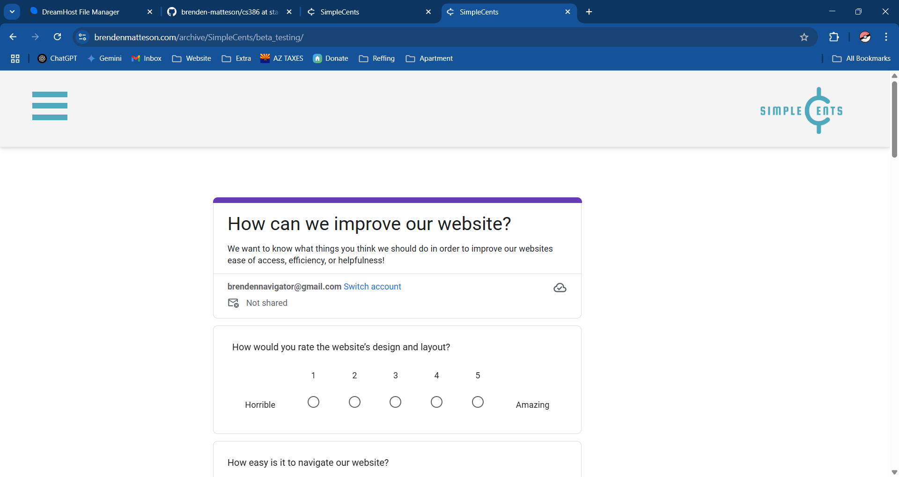

Requirement: As a user of the financial website, I want to access reliable information about credit scores, credit cards, and financial habits so that I can be informed and improve my financial well-being.

Issue: https://github.com/brenden-matteson/cs386/issues/34

Pull request: https://github.com/brenden-matteson/cs386/pull/42

Implemented by: Jered Angous

Approved by: Jered Angous

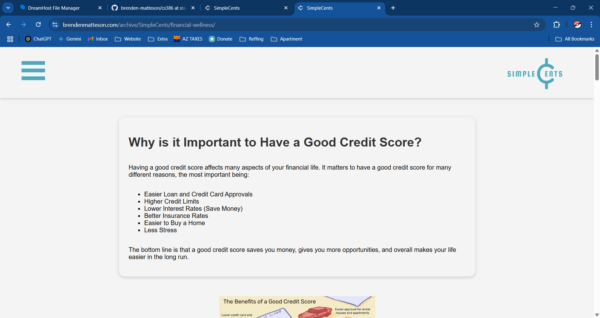

Requirement: As a user of SimpleCents, I want to be able to use SimpleCents on my phone, so that I check my finances more easily.

Issue: https://github.com/brenden-matteson/cs386/issues/51

Pull Request: https://github.com/brenden-matteson/cs386/pull/44 

Implemented By: Brenden Matteson

Approved By: Jered Angous

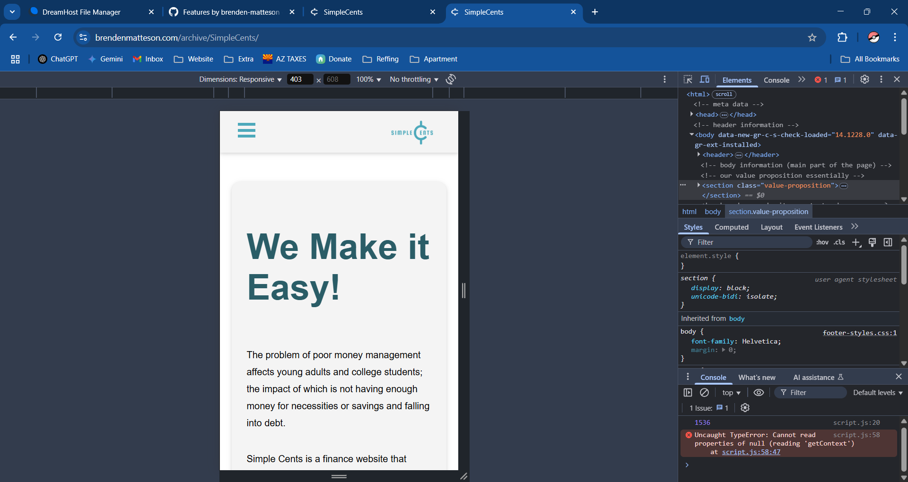
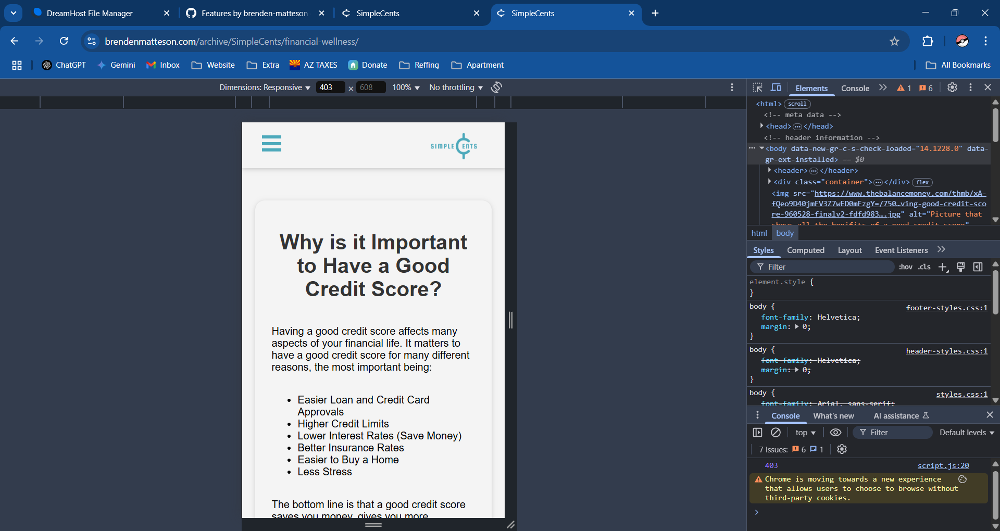
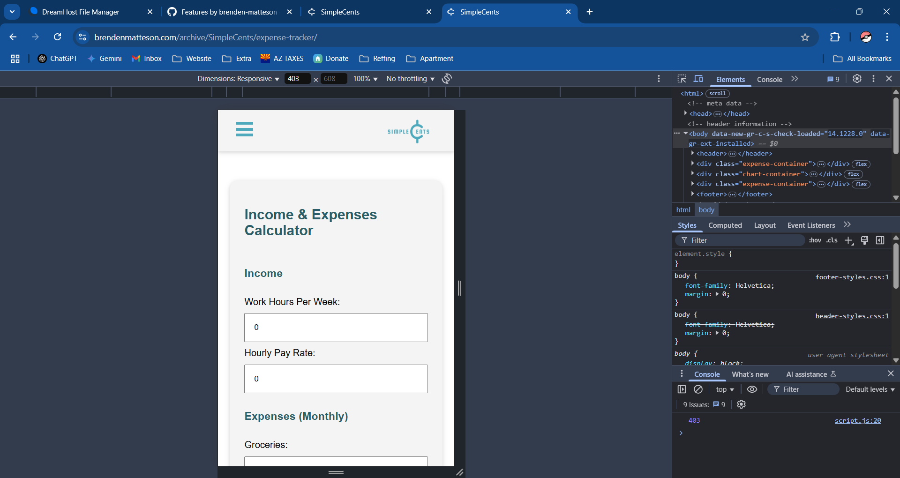

Requirement: As a User, I want each page in the website to look cohesive, so that the website feels more refined and thought out.

Issue:
* https://github.com/brenden-matteson/cs386/issues/49
* https://github.com/brenden-matteson/cs386/issues/50

Pull Request: https://github.com/brenden-matteson/cs386/pull/44 

Implemented By: Brenden Matteson

Approved By: Jered Angous

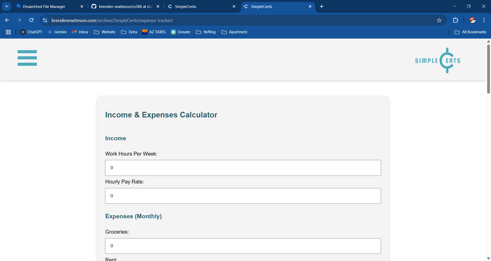

Requirement: As a 20 year old who has a hard time saving money, I want to be able to visualize my spending habits so that I can refine them to be able to save more.

Issue:
* https://github.com/brenden-matteson/cs386/issues/22
* https://github.com/brenden-matteson/cs386/issues/33

Pull Request: https://github.com/brenden-matteson/cs386/pull/42 

Implemented By: Tyson Charles

Approved By: Jered Angous

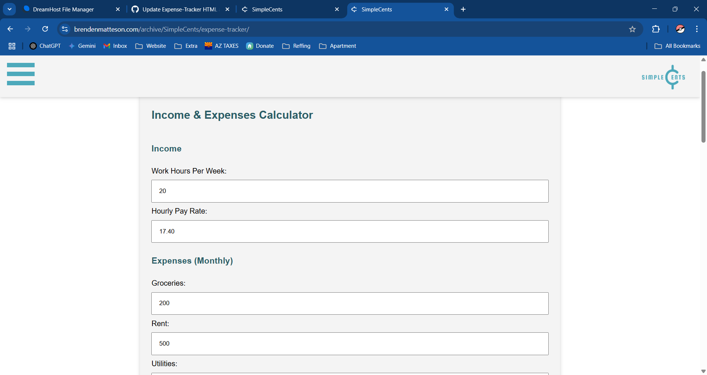
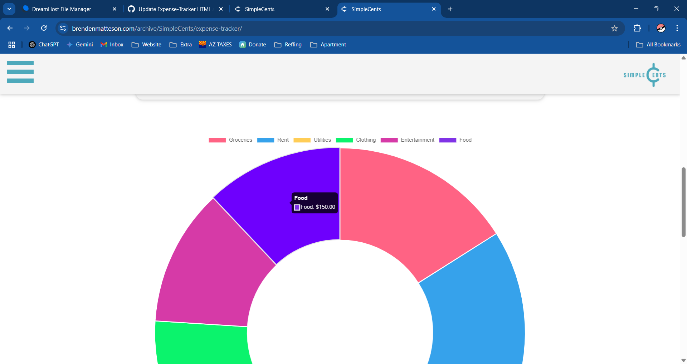

## Tests

## Technology

1. **HTML (Hypertext Markup Language)**
* Description: The standard language for structuring the content of web pages.
* Justification: It serves as the foundation of any website, ensuring that content like text, images, and videos are properly displayed.

2. **CSS (Cascading Style Sheets)**
* Description: A styling language used to design and enhance the visual appearance of a website.
* Justification: Provides consistent design elements across pages and improves user experience with appealing layouts and responsive designs.

3. **JavaScript**
* Description: A programming language enabling interactive features like dropdown menus, sliders, and dynamic content updates.
* Justification: Enhances user engagement and functionality, making websites more dynamic and interactive.

4. **Git**
* Description: A tool to track and manage code changes collaboratively.
* Justification: Helps teams maintain code integrity, resolve conflicts, and revert to previous versions when needed.

5. **Visual Studio Code**
* Description: A tool to help write and test code for the website.
* Justification: Helps developers write code faster and see instant implementation.

## Deployment

https://brendenmatteson.com/archive/SimpleCents-web/ 

We are soft deploying our system on one of our member's personal website, to make it cheaper to host.

The website is hosted on DreamHost under the brendenmatteson.com domain.

## Licensing

MIT LICENSE, we chose this license because it best reflected our intentions with the website. It allows for others to contribute, modify, and distribute the website as they please.

## Readme File

All of our files are located in the root directory of the repository.

## UX Design

We looked at several other budgeting websites along with what current UX design looks like in practice. It is loosly related to how Apple does their widgets in that each major grouping of elements is a rounded rectangle with a drop shadow.

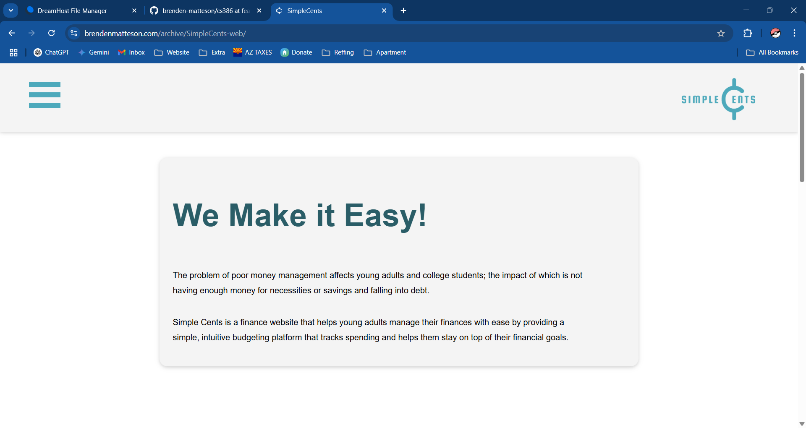
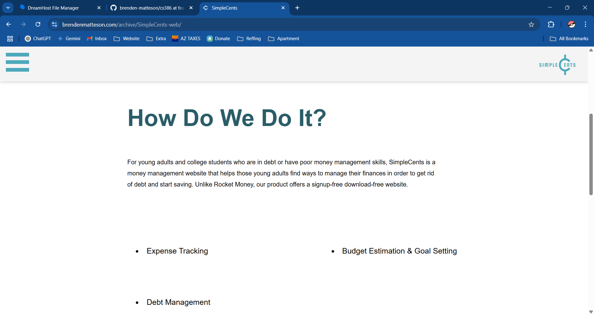
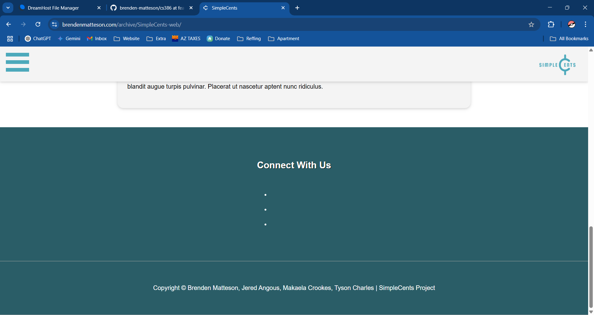

## Lessons Learned

The lessons we learned from the first release is that we need to start the implementation earlier because we were always behind schedule. For the second release we plan on starting earlier and creating a structured timeline so we are always on track for success. 

## Demo

https://youtu.be/wVdF2P1LVas