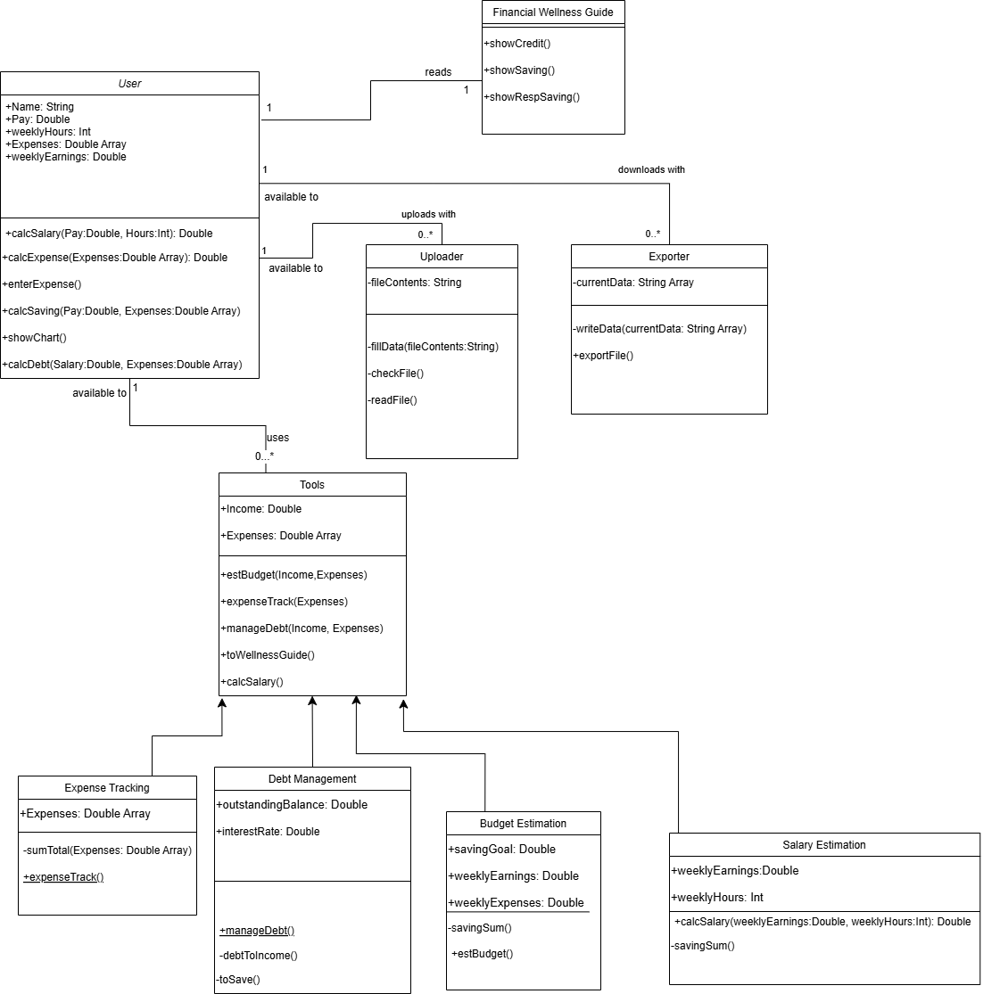

# Diliverable 5

## Description

SimpleCents is a website project meant to assist young adults and college students with their spending habits, it also intends to improve their financial literacy. We provide options for our users to visualize their spending habits in a pie chart, compared to their income, we help them visualize their debt and minimum payments necessary towards that debt. We offer information about credit scores and how credit cards work. Our website is a great opportunity for the users to expand on their knowledge and grow a healthy standard for their expenses and money habits.

## Architecture

Our architecture is designed as a monolithic system with lightweight static JSON file storage, prioritizing simplicity and efficiency for a small-scale project like SimpleCents. It separates concerns into three core layers: Presentation Layer for user interactions, Business Logic Layer for processing events and input, and a lightweight Data Handling Module that helps allow us to temporarily store information for our budget creation portion.

## Class Diagram

## Sequence Diagram

Use Case #4: Estimates Yearly Salary and Generates Chart.

Actor: Working college student.

Trigger: User selects the calculate button.

Pre-Conditions: User is on make expense tracker page.

Post-Conditons User receives a visual graph and estimated yearly salary.

Success Scenario:

* User visits SimpleCents
* User navigates to expense tracker
* User inserts income
* User inserts expenses
* User selects the calculate button
* System displays yearly income and expenses to the user
* System generates chart

Alternate Scenario:

* visits SimpleCents
* User navigates to expense tracker
* User selects the calculate button
* System displays an error message

## Design Patterns 

## Design Principles