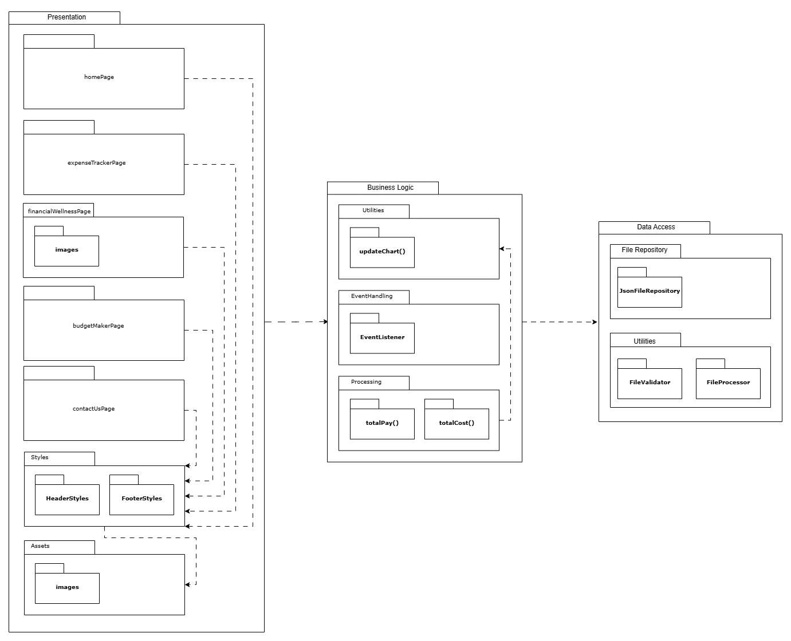
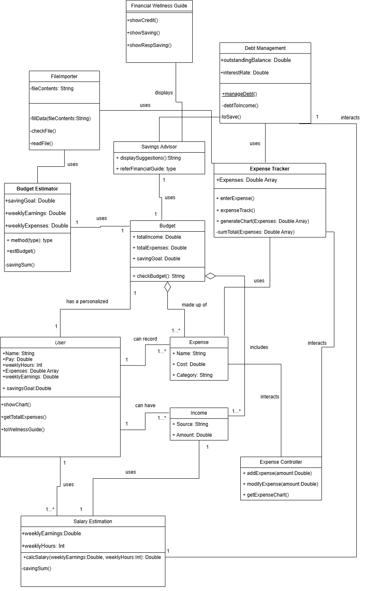
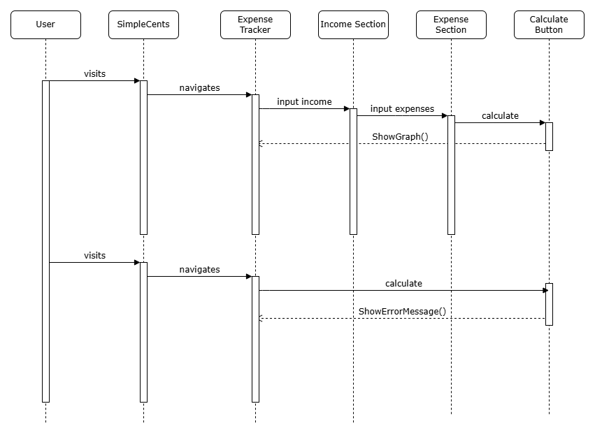
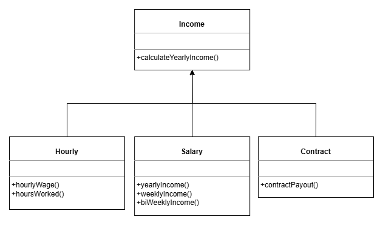
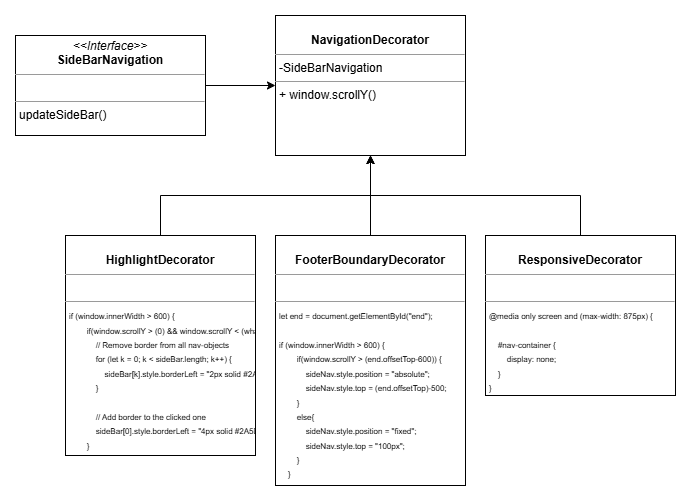

# Diliverable 5

## Description

SimpleCents is a website project meant to assist young adults and college students with their spending habits, it also intends to improve their financial literacy. We provide options for our users to visualize their spending habits in a pie chart, compared to their income, we help them visualize their debt and minimum payments necessary towards that debt. We offer information about credit scores and how credit cards work. Our website is a great opportunity for the users to expand on their knowledge and grow a healthy standard for their expenses and money habits.

## Architecture

Our architecture is designed as a monolithic system with lightweight static JSON file storage (not implemented yet), prioritizing simplicity and efficiency for a small-scale project like SimpleCents. It separates concerns into three core layers: Presentation Layer for user interactions, Business Logic Layer for processing events and input, and a lightweight Data Handling Module that helps allow us to temporarily store information for our budget creation portion.

## Class Diagram

## Sequence Diagram

Use Case #4: Estimates Yearly Salary and Generates Chart.

Actor: Working college student.

Trigger: User selects the calculate button.

Pre-Conditions: User is on make expense tracker page.

Post-Conditons User receives a visual graph and estimated yearly salary.

Success Scenario:

* User visits SimpleCents
* User navigates to expense tracker
* User inserts income
* User inserts expenses
* User selects the calculate button
* System displays yearly income and expenses to the user
* System generates chart

Alternate Scenario:

* visits SimpleCents
* User navigates to expense tracker
* User selects the calculate button
* System displays an error message

## Design Patterns 

Template Method Design Pattern (Behavorial)

https://github.com/brenden-matteson/cs386/blob/features/SimpleCents/expense-tracker/script.js 

Decorator Design Pattern (Structural)

https://github.com/brenden-matteson/cs386/blob/features/SimpleCents/financial-wellness/script.js

## Design Principles

Single responsibility principle- A class should have only one job or responsibility.
* The SRP applies because the classes for our program all do their own job with no overlaps. In our expense tracker java page each class has their own responsibilities. For example there is a class that only works on calculations and a class that only shows the chart updates, these do not overlap and do their own job.

Open/closed principle- A software entity (a class, module, or function) should be open for extensions but closed for modifications
* The OCP applies because in our financial wellness page we have information on how to get a good credit score and suggestions for different credit cards. If we want to add more credit cards or information we don't need to modify the existing code we can just add it underneath thus extending our program but not modifying it.

Interface segregation principle- Clients should not be forced to depend on interfaces they do not use. ISP is about integrating small specific interfaces rather than large general ones.
* The ISP applies because in the expense tracker page of our website we have a function that generates a pie chart for the user to view their spending. The creation of this pie chart relies only on the necessary interfaces. There are no extra interfaces, only the ones required for the pie chart.