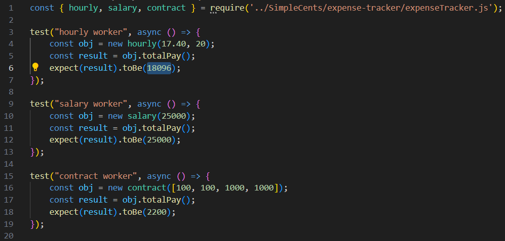
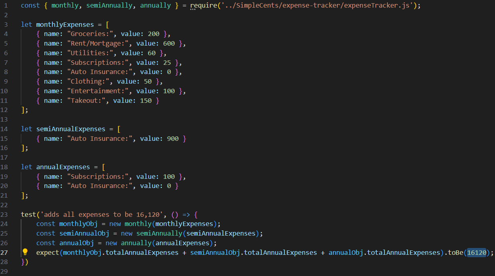

# Deliverable 6

## Introduction

The problem of poor money management affects young adults and college students; the impact of which is not having enough money for necessities or savings and falling into debt. For young adults and college students who are in debt or have poor money management skills, SimpleCents is a money management website that helps those young adults find ways to manage their finances in order to get rid of debt and start saving. Unlike other budgeting applications, our product offers a signup-free download-free website. SimpleCents is a finance website that helps young adults manage their finances with ease by providing a simple, intuitive budgeting platform that tracks spending and helps them stay on top of their financial goals.

SimpleCents is a website project meant to assist young adults and college students with their spending habits, it also intends to improve their financial literacy. We provide options for our users to visualize their spending habits in a pie chart, compared to their income, we help them visualize their debt and minimum payments necessary towards that debt. We offer information about credit scores and how credit cards work. Our website is a great opportunity for the users to expand on their knowledge and grow a healthy standard for their expenses and money habits.

Link to our project: https://github.com/brenden-matteson/cs386 

## Requirements

Requirement: As a user I want a way to navigate the financial wellness page so that it is easier to find the section I am looking for.

Issue: https://github.com/brenden-matteson/cs386/issues/62

Pull request: https://github.com/brenden-matteson/cs386/pull/56

Implemented by: Brenden Matteson

Approved by: Jered Angous

Requirement: As a user I would like to see a neat color gradient for the chart developed that fits in with the website.

Issue: https://github.com/brenden-matteson/cs386/issues/58 

Pull request: https://github.com/brenden-matteson/cs386/pull/60

Implemented by: Makaela Crookes

Approved by: Jered Angous

Requirement: As a user I would like to see a footer that adds to the usability of the website so that I can easily navigate the website.

Issue: https://github.com/brenden-matteson/cs386/issues/63 

Pull request: https://github.com/brenden-matteson/cs386/pull/60 

Implemented by: Brenden Matteson

Approved by: Jered Angous

Requirement: As a user, I want to be able to be able to use multiple sources of income, so that I can find my total annual income.

Issue: https://github.com/brenden-matteson/cs386/issues/47 

Pull request: https://github.com/brenden-matteson/cs386/pull/64 

Implemented by: Brenden Matteson

Approved by: Jered Angous

Requirement: As a user, I have costs that draft at different time frames during the year, so I want to be able to track the annual cost of all my expenses.

Issue: https://github.com/brenden-matteson/cs386/issues/48   

Pull request: https://github.com/brenden-matteson/cs386/pull/65  

Implemented by: Brenden Matteson

Approved by: Jered Angous

Requirement: As a user, I want to be be able to contact the developers of SimpleCents, so that I can let them know if there is any problems.

Issue: https://github.com/brenden-matteson/cs386/issues/35 

Pull request: https://github.com/brenden-matteson/cs386/pull/57 

Implemented by: Jered Angous

Approved by: Brenden Matteson

## Tests

The testing framework that we used is jest, which is a JavaScript Testing Framework that uses node.js. The node_modules are hosted locally because theyre the same no matter the installation, so we dont have the node_modules in our GitHub repository.

Link to tests folder: https://github.com/brenden-matteson/cs386/tree/main/node-test

**Test Case Example 1:**

This test case checks to ensure that the calculations for our income class is working as it should. We run three tests, one for each type of income that we use, hourly, salary, and contract.

For our hourly class, the test creates a hourly object populated with two values: 17.40 for hourly wage, and 20 for hours per week. It then checks to make sure that the total annual income is equal to 18096.

For our salary class, the test creates a salary object populated with one value: 25000 for yearly salary. It then checks to make sure that the total annual income is equal to that value.

For our contract class, the test creates a contract object populated with an array of four contract payouts: 100, 100, 1000, and 1000. It then checks that the total annual income is equal to 2200.

**Test Case Example 2:**

This test case checks to ensure that the calculations for our expense class is working as it should. We run 1 test that encorporates all three of our subclasses, monthly, semi-annually and annually.

This test creates three mock object arrays to simulate the HTMLCollections that is used in our expense tracker page. One for monthly expenses, another for semi-annual expenses, and another for annual expenses. The monthly expenses should be multiplied by 12, semi-annual by 2, and yearly as is. It then checks to that the total expenses is equal to 16120.

When running the tests, it checks all test suites.

**Results:**

## Demo

## Code Quality

Before implementation 1, we created a “requirements” document in our files directory which contained the rules that we would be using for our implementation including webpage layout, naming conventions, css formatting, and javascript formatting. Most of these requirements are relatively standard for most web development, but we wanted to make sure we were all working with the same rules so that our code looks cohesive. 

Here’s a link to our requirements document in our GitHub repository:

https://github.com/brenden-matteson/cs386/blob/main/SimpleCents/files/requirements.md

## Lessons Learned

During this second release our team learned a lot. We found the efficiency of working together is a lot better than working alone. We also learned that it is important to start working on deliverables way ahead of time to allow for mistakes as well as to allow for the best possible work. Sending our work to be looked over was extremely useful and important to our success. If we were to continue developing the project there is not much we would change, we worked pretty efficiently together.