# Deliverable 6

## Introduction

The problem of poor money management affects young adults and college students; the impact of which is not having enough money for necessities or savings and falling into debt. For young adults and college students who are in debt or have poor money management skills, SimpleCents is a money management website that helps those young adults find ways to manage their finances in order to get rid of debt and start saving. Unlike other budgeting applications, our product offers a signup-free download-free website. SimpleCents is a finance website that helps young adults manage their finances with ease by providing a simple, intuitive budgeting platform that tracks spending and helps them stay on top of their financial goals.

SimpleCents is a website project meant to assist young adults and college students with their spending habits, it also intends to improve their financial literacy. We provide options for our users to visualize their spending habits in a pie chart, compared to their income, we help them visualize their debt and minimum payments necessary towards that debt. We offer information about credit scores and how credit cards work. Our website is a great opportunity for the users to expand on their knowledge and grow a healthy standard for their expenses and money habits.

Link to our project: https://github.com/brenden-matteson/cs386 

## Requirements

Requirement: As a user I want a way to navigate the financial wellness page so that it is easier to find the section I am looking for.

Issue: https://github.com/brenden-matteson/cs386/issues/62

Pull request: https://github.com/brenden-matteson/cs386/pull/56

Implemented by: Brenden Matteson

Approved by: Jered Angous

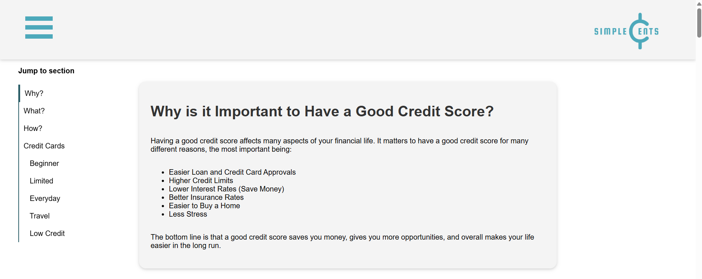

Requirement: As a user I would like to see a neat color gradient for the chart developed that fits in with the website.

Issue: https://github.com/brenden-matteson/cs386/issues/58 

Pull request: https://github.com/brenden-matteson/cs386/pull/60

Implemented by: Makaela Crookes

Approved by: Jered Angous

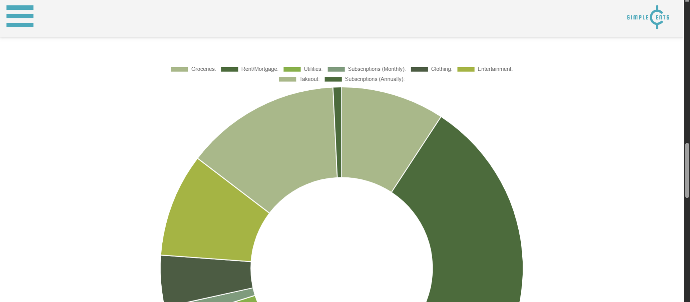

Requirement: As a user I would like to see a footer that adds to the usability of the website so that I can easily navigate the website.

Issue: https://github.com/brenden-matteson/cs386/issues/63 

Pull request: https://github.com/brenden-matteson/cs386/pull/60 

Implemented by: Brenden Matteson

Approved by: Jered Angous

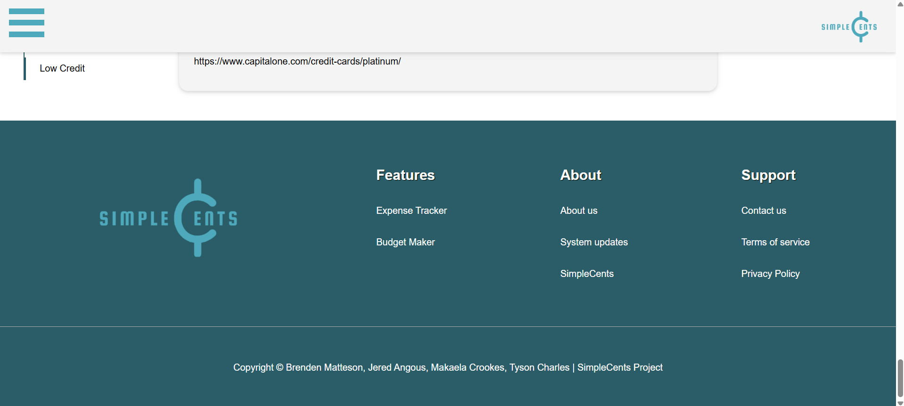

Requirement: As a user, I want to be able to be able to use multiple sources of income, so that I can find my total annual income.

Issue: https://github.com/brenden-matteson/cs386/issues/47 

Pull request: https://github.com/brenden-matteson/cs386/pull/64 

Implemented by: Brenden Matteson

Approved by: Jered Angous

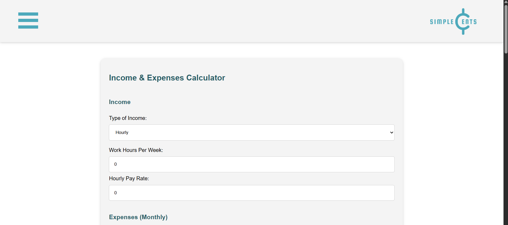

Requirement: As a user, I have costs that draft at different time frames during the year, so I want to be able to track the annual cost of all my expenses.

Issue: https://github.com/brenden-matteson/cs386/issues/48   

Pull request: https://github.com/brenden-matteson/cs386/pull/65  

Implemented by: Brenden Matteson

Approved by: Jered Angous

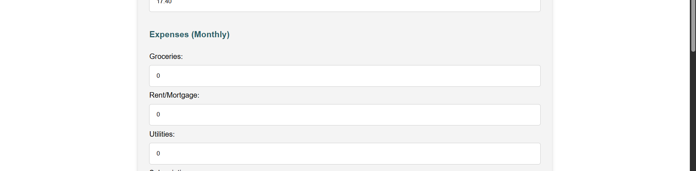
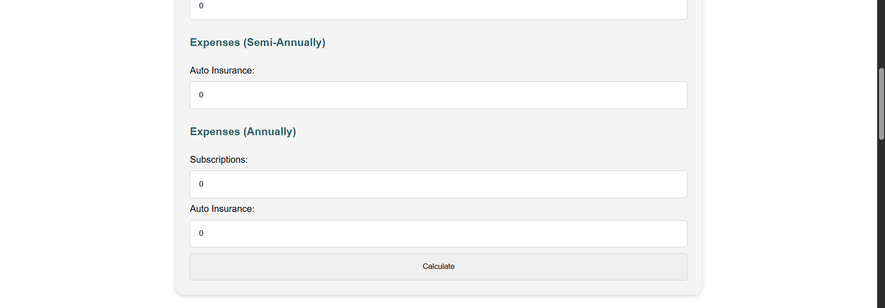

Requirement: As a user, I want to be be able to contact the developers of SimpleCents, so that I can let them know if there is any problems.

Issue: https://github.com/brenden-matteson/cs386/issues/35 

Pull request: https://github.com/brenden-matteson/cs386/pull/57 

Implemented by: Jered Angous

Approved by: Brenden Matteson

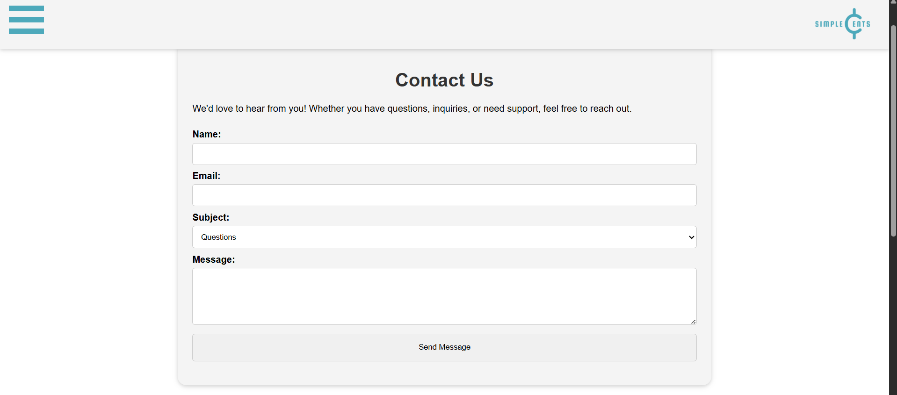

Requirement: As a user, I want to be able to create a simple budget, so that I can know how much money I need to save each month.

Issue: https://github.com/brenden-matteson/cs386/issues/32 

Pull request: https://github.com/brenden-matteson/cs386/pull/66 

Implemented by: Tyson Charles

Approved by: Jered Angous

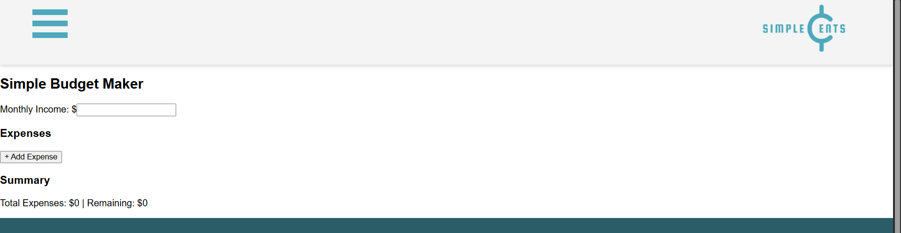

## Tests

The testing framework that we used is jest, which is a JavaScript Testing Framework that uses node.js. The node_modules are hosted locally because theyre the same no matter the installation, so we dont have the node_modules in our GitHub repository.

Link to tests folder: https://github.com/brenden-matteson/cs386/tree/main/node-test

**Test Case Example 1:**

Link to class: https://github.com/brenden-matteson/cs386/blob/main/SimpleCents/expense-tracker/income.js

This test case checks to ensure that the calculations for our income class is working as it should. We run three tests, one for each type of income that we use, hourly, salary, and contract.

For our hourly class, the test creates a hourly object populated with two values: 17.40 for hourly wage, and 20 for hours per week. It then checks to make sure that the total annual income is equal to 18096.

For our salary class, the test creates a salary object populated with one value: 25000 for yearly salary. It then checks to make sure that the total annual income is equal to that value.

For our contract class, the test creates a contract object populated with an array of four contract payouts: 100, 100, 1000, and 1000. It then checks that the total annual income is equal to 2200.

The final test then checks to make sure when you have multiple sources of income, the total annual income is the sum of all the income sources.

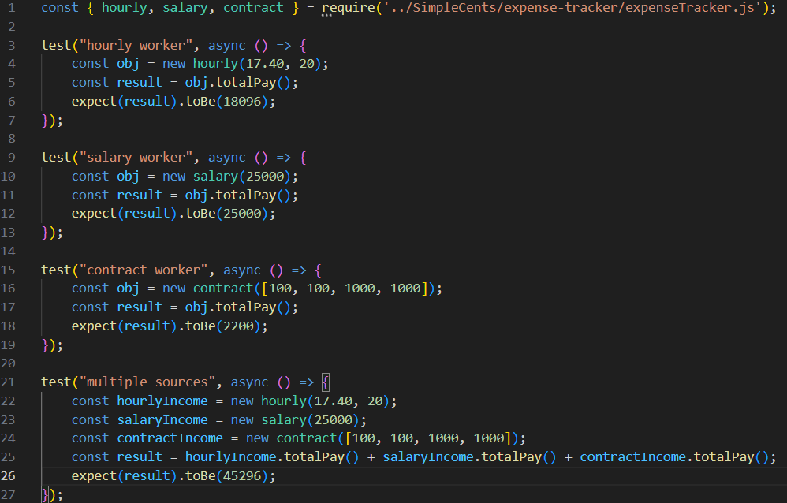

**Test Case Example 2:**

Link to class: https://github.com/brenden-matteson/cs386/blob/main/SimpleCents/expense-tracker/expense.js

This test case checks to ensure that the calculations for our expense class is working as it should. We run 4 tests that encorporates all three of our subclasses, monthly, semi-annually and annually.

This test creates three mock object arrays to simulate the HTMLCollections that is used in our expense tracker page. One for monthly expenses, another for semi-annual expenses, and another for annual expenses. The monthly expenses should be multiplied by 12, semi-annual by 2, and yearly as is. 

The first test checks that the monthly expenses were properly handled and multipled to annual expenses.

The second test checks that the semi annual expenses were properly handled and multipled to annual expenses.

The third test checks that the annual expenses are properly handled.

The final test then checks to that the total expenses is equal to 16120.

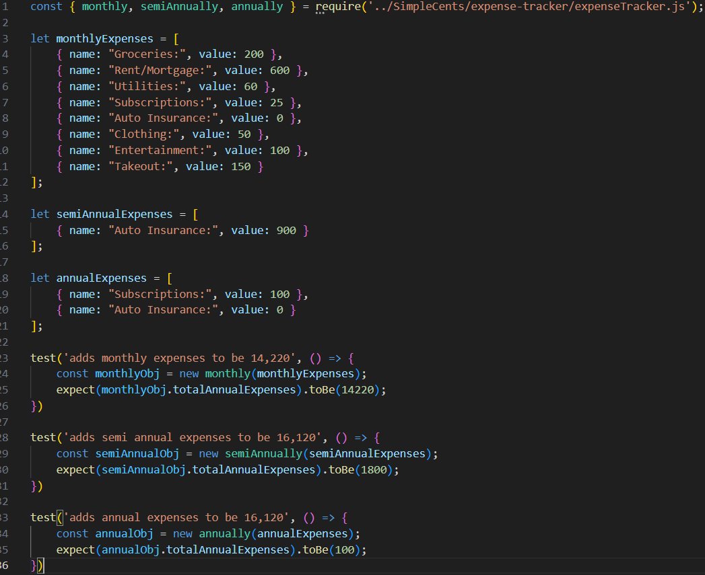
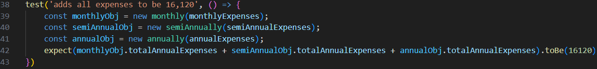

When running the tests, it checks all test suites.

**Results:**

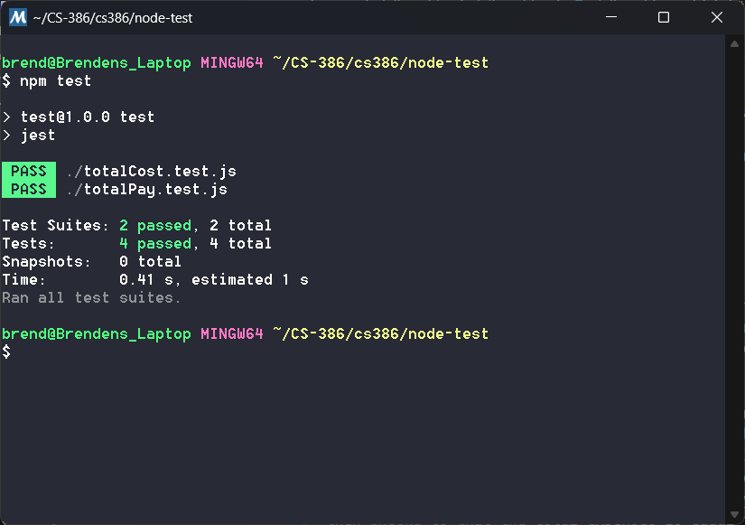

## Demo

we dont have a demo yet!

## Code Quality

Before implementation 1, we created a “requirements” document in our files directory which contained the rules that we would be using for our implementation including webpage layout, naming conventions, css formatting, and javascript formatting. Most of these requirements are relatively standard for most web development, but we wanted to make sure we were all working with the same rules so that our code looks cohesive. 

### HTML

**Webpage Layout**

Use "head" at the top of the document for meta data.

Use "header" to contain the header.

Use "body" to contain the main part of the webpage

* Use "section" to identify sections inside the body of the webpage.

* Use "containers" to identify different sub-sections of each section.

* Use "objects" relating to those containers to identify what content is going in each container.

Use "footer" to contain the footer.

All styles and scripts should be contained in their respective reference files. 

**Naming Conventions**

Use the format "name_of_section" for sections

Use the format "name_of_section"-container for container elements

Use the format "name_of_section"-object for objects in containers

Use the same design language for naming other elements that may not fit in these categories.

**Header and Footer**

There will be a header and footer for every page that should be the same, to keep this continuity, they should use the same stylesheet, referenced as "header-styles.css" and "footer-styles.css" respectively. The implementation of both the header and the footer should be the same accross all contained webpages.

### CSS

**CSS Formatting**

The styles used for each class or id of element should be in the CSS file in the order that they are used in the HTML file.

There should be media query's at the end of the file to properly scale elements from desktop to mobile screen sizes. 

* We should agree on what pixel sizes imply a change in the scale.

### JS

The elements referenced should be easier to deal with because of our naming conventions, and should keep the same design language if creating new variables for exporting.

## Lessons Learned

During this second release our team learned a lot. We found the efficiency of working together is a lot better than working alone. We also learned that it is important to start working on deliverables way ahead of time to allow for mistakes as well as to allow for the best possible work. Sending our work to be looked over was extremely useful and important to our success. What we learned from developing this project is that creating this website led to an improvement of our overall coding skills as well as tested our abilities to come up with solutions to complex problems. We also learned some new features of VSCode that were previously not on our radars. If we were to continue developing the project we would change how we delegated tasks to allow for further contribution from all members.