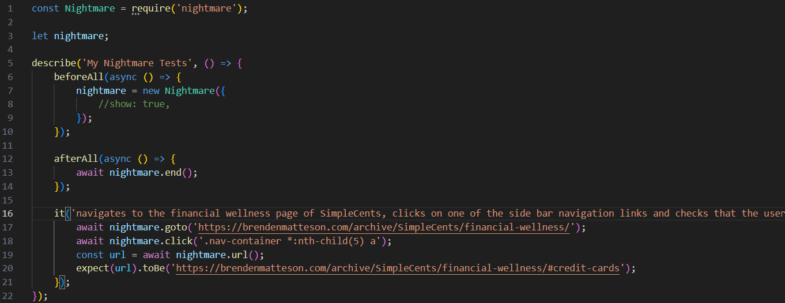

# Deliverable 7

## Description

The problem of poor money management affects young adults and college students; the impact of which is not having enough money for necessities or savings and falling into debt. For young adults and college students who are in debt or have poor money management skills, SimpleCents is a money management website that helps those young adults find ways to manage their finances in order to get rid of debt and start saving. Unlike other budgeting applications, our product offers a signup-free download-free website. SimpleCents is a finance website that helps young adults manage their finances with ease by providing a simple, intuitive budgeting platform that tracks spending and helps them stay on top of their financial goals.

SimpleCents is a website project meant to assist young adults and college students with their spending habits, it also intends to improve their financial literacy. We provide options for our users to visualize their spending habits in a pie chart, compared to their income, we help them visualize their debt and minimum payments necessary towards that debt. We offer information about credit scores and how credit cards work. Our website is a great opportunity for the users to expand on their knowledge and grow a healthy standard for their expenses and money habits.

## Verification

The testing framework that we used is jest, which is a JavaScript Testing Framework that uses node.js. The node_modules are hosted locally because they are the same no matter the installation, so we do not have the node_modules in our GitHub repository.

Link to automatic unit tests folder: https://github.com/brenden-matteson/cs386/tree/main/unit-test

**Test Case Example 1:**

This test case tests specifically the monthly class of expenses. Two mock object are created, one with valid values for each expense and the other with an invalid number (negative). The first test checks that the object made from the valid mock object returns the correct total, and the other test checks to make sure that the negative value is not included in the total.

Link to class: https://github.com/brenden-matteson/cs386/blob/main/SimpleCents/expense-tracker/income.js

Link to test: https://github.com/brenden-matteson/cs386/tree/main/unit-test/monthlyExpense.test.js

**Test Case Example 2:**

This test case tests specifically the hourly class of income. Two tests are used, one creating a mock object with valid inputs for hourlyPay and hoursPerWeek and another test with an invalid input (empty) for the hoursPerWeek. The first test checks that the correct total is calculated and the second test checks that the total is 0 because no pay could be estimated from the invalid input.

Link to class: https://github.com/brenden-matteson/cs386/blob/main/SimpleCents/expense-tracker/expense.js

Link to test: https://github.com/brenden-matteson/cs386/tree/main/unit-test/hourlyIncome.test.js

**Results**

The other two test suites (totalPay and totalCost) ran are previous tests.

## Acceptance Tests

The test framework we used to develop our tests was jest, which is a JavaScript Testing Framework that uses node.js in conjunction with nightmare which is a high-level browser automation library from Segment. They work together by using nightmare to set up a mock webpage environment and then mimics the user inputting values on the page and then once an output is put on the screen, jest tests to make sure the correct output is observed.

Link to automatic acceptance tests folder: https://github.com/brenden-matteson/cs386/tree/main/acceptance-test

**Test Case Example 1:**

The first test case is two acceptance tests on the home page of SimpleCents. 

The first test navigates to the home page, waits for the page to respond and gets the title of the page, then it checks that the title is 'SimleCents' checking that the url correctly identifies itself.

The second test stays on the home page, and nightmare parses the value proposition section of the page, then jest checks that the section contains the phrase "We Make it Easy!" which is the title of our value proposition section, essentially checking that the page shows the text it should to the user.

Link to test: https://github.com/brenden-matteson/cs386/tree/main/acceptance-test/SimpleCents.test.js

**Test Case Example 2:**

The second test case is two acceptance tests on the expense tracker page of SimpleCents.

The first test navigates to the expense tracker page of SimpleCents, then nightmare mimics inputs for hourlyPay and hoursPerWeek. Then it mimics the user clicking the calculate button. Then jest tests to see if the income value output to the user is correct.

The second test stays on the expense tracker page and nightmare mimics input for each category of expenses, monthly, semi annually, and annually. Then it mimics the user clicking the calculate button. Then jest checks that the remaining balance output to the user is correct with the given income and expense values.

Link to test: https://github.com/brenden-matteson/cs386/tree/main/acceptance-test/expenseTracker.test.js

**Test Case Example 3:**

The third test case is one acceptance test on the budget maker page of SimpleCents.

The test uses nightmare to navigate to the budget maker page, then it mimics the user selecting the salary type of income, inputting a salary value, inputting some values for essential expenses, and then clicking the calculate button. Jest then checks to see that the total expenses and remaining balance are correctly output to the user.

Link to test: https://github.com/brenden-matteson/cs386/tree/main/acceptance-test/budgetMaker.test.js

**Test Case Example 4:**

The fourth test case is one acceptance test on the financial wellness page of SimpleCents.

The test uses nightmore to navigate to the financial wellness page, then it mimics the user clicking one of the navigation links on the side bar navigation. Jest then checks to make sure that the url that the link navigates to is the correct section.

Link to test: https://github.com/brenden-matteson/cs386/tree/main/acceptance-test/financialWellness.test.js

**Results:**

## Validation

Script: 

Hello [user], I wanted to talk to you about this project we’ve been working on called SimpleCents. SimpleCents is a simple, intuitive budgeting platform that tracks spending to help young adults stay on top of their financial goals. The point of this interview is to get some feedback on our current system. I have some tasks for you and some questions to answer if you’d be willing.

User Tasks:

* Enter potential income
    * Use the dropdown menu to select (whichever applicable to you)
* Enter potential expenses (whichever applicable to you)
    * Add any additional expenses not already listed.
* Enter a potential savings goal.
* Read the financial wellness page.

**Interview 1:**

Who was interviewed: Ava Sabo

Who was the interviewee: Brenden Matteson

How would you rate the website’s design and layout on a scale of 1 to 5 (1 being horrible, 5 being amazing)? 

* 5

How easy is it to navigate our website?

* Very easy and self explanatory. Very user friendly.

Was our information useful? Why or why not? 

* I think this website is great for people who are very money conscious and want a structured guideline to follow to achieve their financial goals, i’m not really that person…

How trustworthy do you feel the information on our website is? 

* I feel like it's trustworthy. All the calculations seemed to be accurate. 

Did you encounter any errors or technical issues while using the site? If so, what? 

* I experienced no issues.

What type of content would you like to see more of? 

* Maybe making a feature to create a spending limit so you have an idea of the money you are able to spend before you run out.

Which features of our website would you use the most? 

* Probably the one that calculated the savings goal, it is very easy to use and could give me answers for multiple different goals so I could find out what was realistic for me.

Do you think our tools are easy to use and understand? Why or why not? 

* Yes! Very user friendly site and an easy approach to start budgeting and thinking about finances.

How old are you?

* 19

Overall, how satisfied are you with your experience on our website on a scale of 1 to 5 (1 being not satisfied at all, 5 being very satisfied)?

* 5

Would you recommend our website to a friend or colleague?  

* Yes.

**Interview 2:**

Who was interviewed: Aitor Campos

Who was the interviewee: Makaela Crookes

How would you rate the website’s design and layout on a scale of 1 to 5 (1 being horrible, 5 being amazing)? 

* 4

How easy is it to navigate our website?

* Pretty intuitive, it's similar to other websites I’ve used before.

Was our information useful? Why or why not? 

* Helpful as a free and easy budgeting platform, very nice.

How trustworthy do you feel the information on our website is? 

* Semi-trustworthy, I’m not totally confident in its reliability.

Did you encounter any errors or technical issues while using the site? If so, what? 

* The entire support section sends me to the contact us page with the option to send a support ticket; this happens even if I'm just trying to see the Privacy policy or the third option in that category.

What type of content would you like to see more of? 

* Maybe a way to change the tax rate? Not sure if it’s set in my local area.

Which features of our website would you use the most? 

* Budgeting calculator.

Do you think our tools are easy to use and understand? Why or why not? 

* Yes, UI was really responsive and laid out well.

How old are you?

* 20

Overall, how satisfied are you with your experience on our website on a scale of 1 to 5 (1 being not satisfied at all, 5 being very satisfied)?

* 5

Would you recommend our website to a friend or colleague?  

* Yes, it is a very useful website.

**Interview 3:**

Who was interviewed: Aedan Howell

Who was the interviewee: Brenden Matteson

How would you rate the website’s design and layout on a scale of 1 to 5 (1 being horrible, 5 being amazing)? 

* 4

How easy is it to navigate our website?

* Very easy and accessible.

Was our information useful? Why or why not? 

* The information was extremely useful and better than most financial calculators I have used in the past.

How trustworthy do you feel the information on our website is? 

* Very trustworthy.

Did you encounter any errors or technical issues while using the site? If so, what? 

* I did not encounter any errors.

What type of content would you like to see more of? 

* The financial calculators are very nice maybe expanding into having more of those.

Which features of our website would you use the most? 

* The expense tracker.

Do you think our tools are easy to use and understand? Why or why not? 

* Yes the tools are easy to understand, the are well documented.

How old are you?

* 20

Overall, how satisfied are you with your experience on our website on a scale of 1 to 5 (1 being not satisfied at all, 5 being very satisfied)?

* 4

Would you recommend our website to a friend or colleague?  

* Yes.

**Interview 4:**

Who was interviewed: Jeysen Angous

Who was the interviewee: Jered Angous

How would you rate the website’s design and layout on a scale of 1 to 5 (1 being horrible, 5 being amazing)? 

* 4.5

How easy is it to navigate our website?

* Very easy and straightforward, dropdown menu is very handy.

Was our information useful? Why or why not? 

* The information was very useful and I was able to learn more about having the importance of a good credit score and how it can affect you financially.

How trustworthy do you feel the information on our website is? 

* Fully trustworthy.

Did you encounter any errors or technical issues while using the site? If so, what? 

* No.

What type of content would you like to see more of? 

* No comment.

Which features of our website would you use the most? 

* More visuals on the home page such as pictures to make it stand out.

Do you think our tools are easy to use and understand? Why or why not? 

* Yes very easy and straightforward. Having the export feature is a great addition.

How old are you?

* 23

Overall, how satisfied are you with your experience on our website on a scale of 1 to 5 (1 being not satisfied at all, 5 being very satisfied)?

* 5

Would you recommend our website to a friend or colleague?  

* Yes.

**Interview 5:**

Who was interviewed: Brad Pinto

Who was the interviewee: Tyson Charles

How would you rate the website’s design and layout on a scale of 1 to 5 (1 being horrible, 5 being amazing)? 

* 4.5

How easy is it to navigate our website?

* It was easy to navigate, I just needed a bit of an explanation for what the section should calculate.

Was our information useful? Why or why not? 

* The information was useful because it gave me more insight that I never thought of and it helped me picture my expenses more clearly.

How trustworthy do you feel the information on our website is? 

* Very trustworthy

Did you encounter any errors or technical issues while using the site? If so, what? 

* Nope none that I could cause.

What type of content would you like to see more of? 

* No idea.

Which features of our website would you use the most? 

* I liked the chart creation as it helped give a visual of my expenses

Do you think our tools are easy to use and understand? Why or why not? 

* Yes they were easy to understand and straight to the point.

How old are you?

* 19

Overall, how satisfied are you with your experience on our website on a scale of 1 to 5 (1 being not satisfied at all, 5 being very satisfied)?

* 5

Would you recommend our website to a friend or colleague?  

* Yes.

**Interview Reflection:**

The users found that the information on our website was very helpful, it was intuitive for them to use and the budget maker is very useful. The users also found that our information may not be trustworthy, what we can do to help with that is provide reputable sources to back our information. The support section needs to be adjusted as users were unable to use select links to get help. The last complaint we received was that our users would like to see a tax selector so that they may choose which tax rate applies to them. The users found that there was not a harsh learning curve, rather that the website was easy to navigate and similar to websites they’ve used before. The users performed the tasks as expected by visiting the budget making page, testing links, and reading through our information page. Users found that the majority of these tasks returned the expected results with only our support pages lacking. The users seemed to enjoy the most, that the website was easy and intuitive to use. They also liked seeing their finances laid out in a pie chart to better visualize their spending habits. We ended up accomplishing our value proposition, we created a place for young adults and college students to go in order to better understand their finances and track them easily.