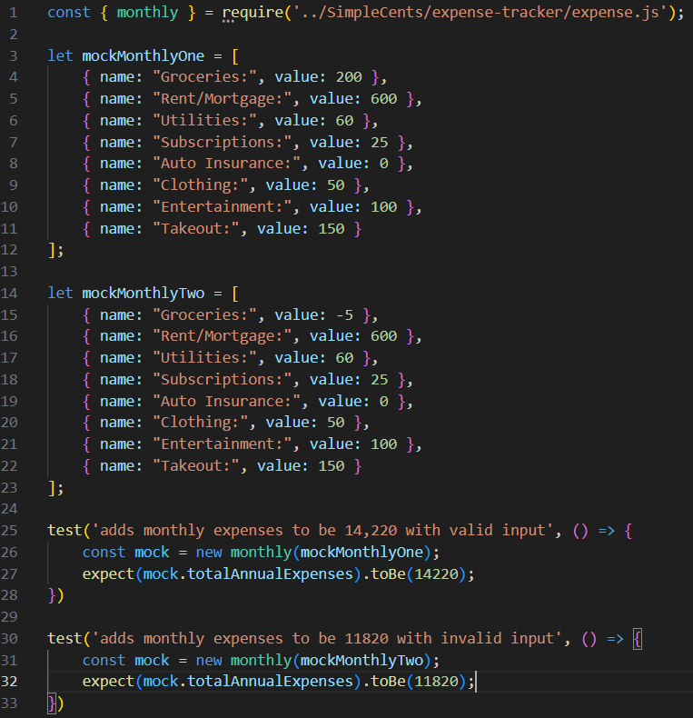
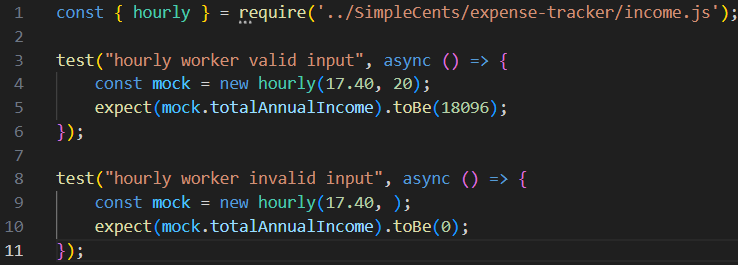
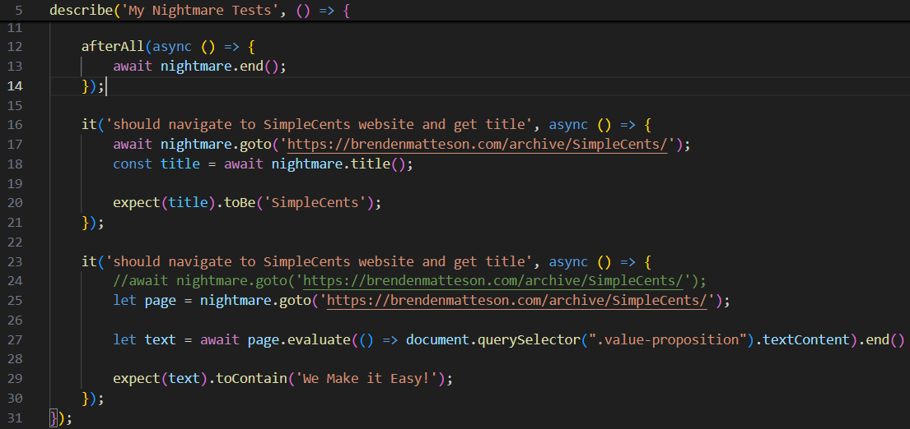
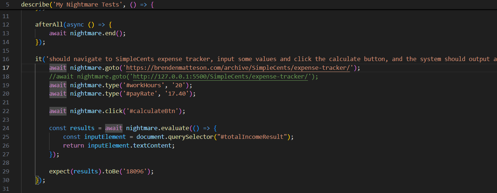
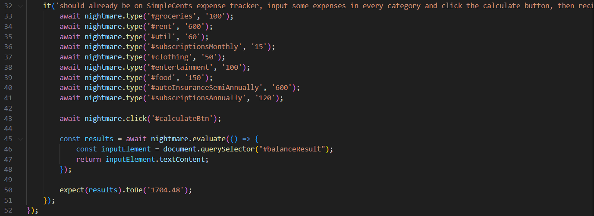
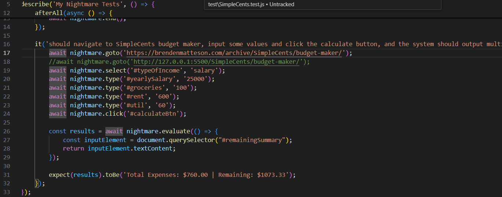
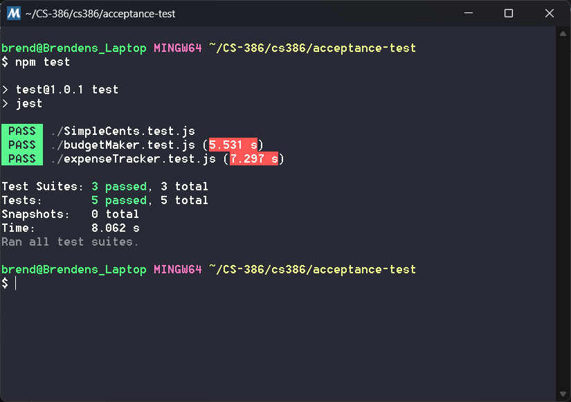

# Deliverable 7

## Description

The problem of poor money management affects young adults and college students; the impact of which is not having enough money for necessities or savings and falling into debt. For young adults and college students who are in debt or have poor money management skills, SimpleCents is a money management website that helps those young adults find ways to manage their finances in order to get rid of debt and start saving. Unlike other budgeting applications, our product offers a signup-free download-free website. SimpleCents is a finance website that helps young adults manage their finances with ease by providing a simple, intuitive budgeting platform that tracks spending and helps them stay on top of their financial goals.

SimpleCents is a website project meant to assist young adults and college students with their spending habits, it also intends to improve their financial literacy. We provide options for our users to visualize their spending habits in a pie chart, compared to their income, we help them visualize their debt and minimum payments necessary towards that debt. We offer information about credit scores and how credit cards work. Our website is a great opportunity for the users to expand on their knowledge and grow a healthy standard for their expenses and money habits.

## Verification

The testing framework that we used is jest, which is a JavaScript Testing Framework that uses node.js. The node_modules are hosted locally because theyre the same no matter the installation, so we dont have the node_modules in our GitHub repository.

Link to automatic unit tests folder: https://github.com/brenden-matteson/cs386/tree/main/unit-test

**Test Case Example 1:**

This test case tests specifically the monthly class of expenses. Two mock object are created, one with valid values for each expense and the other with an invalid number (negative). The first test checks that the object made from the valid mock object returns the correct total, and the other test checks to make sure that the negative value is not included in the total.

Link to class: https://github.com/brenden-matteson/cs386/blob/main/SimpleCents/expense-tracker/income.js

Link to test: https://github.com/brenden-matteson/cs386/tree/main/unit-test/monthlyExpense.test.js

**Test Case Example 2:**

This test case tests specifically the hourly class of income. Two tests are used, one creating a mock object with valid inputs for hourlyPay and hoursPerWeek and another test with an invalid input (empty) for the hoursPerWeek. The first test checks that the correct total is calculated and the second test checks that the total is 0 because no pay could be estimated from the invalid input.

Link to class: https://github.com/brenden-matteson/cs386/blob/main/SimpleCents/expense-tracker/expense.js

Link to test: https://github.com/brenden-matteson/cs386/tree/main/unit-test/hourlyIncome.test.js

**Results**

The other two test suites (totalPay and totalCost) ran are previous tests.

## Acceptance Tests

The test framework we used to develop our tests was jest, which is a JavaScript Testing Framework that uses node.js in conjunction with nightmare which is a high-level browser automation library from Segment. They work together by using nightmare to set up a mock webpage environment and then mimics the user inputting values on the page and then once an output is put on the screen, jest tests to make sure the correct output is observed.

Link to automatic acceptance tests folder: https://github.com/brenden-matteson/cs386/tree/main/acceptance-test

**Test Case Example 1:**

The first test case is two acceptance tests on the home page of SimpleCents. 

The first test navigates to the home page, waits for the page to respond and gets the title of the page, then it checks that the title is 'SimleCents' checking that the url correctly identifies itself.

The second test stays on the home page, and nightmare parses the value proposition section of the page, then jest checks that the section contains the phrase "We Make it Easy!" which is the title of our value proposition section, essentially checking that the page shows the text it should to the user.

Link to test: https://github.com/brenden-matteson/cs386/tree/main/acceptance-test/SimpleCents.test.js

**Test Case Example 2:**

The second test case is two acceptance tests on the expense tracker page of SimpleCents.

The first test navigates to the expense tracker page of SimpleCents, then nightmare mimics inputs for hourlyPay and hoursPerWeek. Then it mimics the user clicking the calculate button. Then jest tests to see if the income value output to the user is correct.

The second test stays on the expense tracker page and nightmare mimics input for each category of expenses, monthly, semi annually, and annually. Then it mimics the user clicking the calculate button. Then jest checks that the remaining balance output to the user is correct with the given income and expense values.

Link to test: https://github.com/brenden-matteson/cs386/tree/main/acceptance-test/expenseTracker.test.js

**Test Case Example 3:**

The third test case is one acceptance test on the budget maker page of SimpleCents.

The test uses nightmare to navigate to the budget maker page, then it mimics the user selecting the salary type of income, inputting a salary value, inputting some values for essential expenses, and then clicking the calculate button. Jest then checks to see that the total expenses and remaining balance are correctly output to the user.

Link to test: https://github.com/brenden-matteson/cs386/tree/main/acceptance-test/budgetMaker.test.js

**Results:**

## Validation