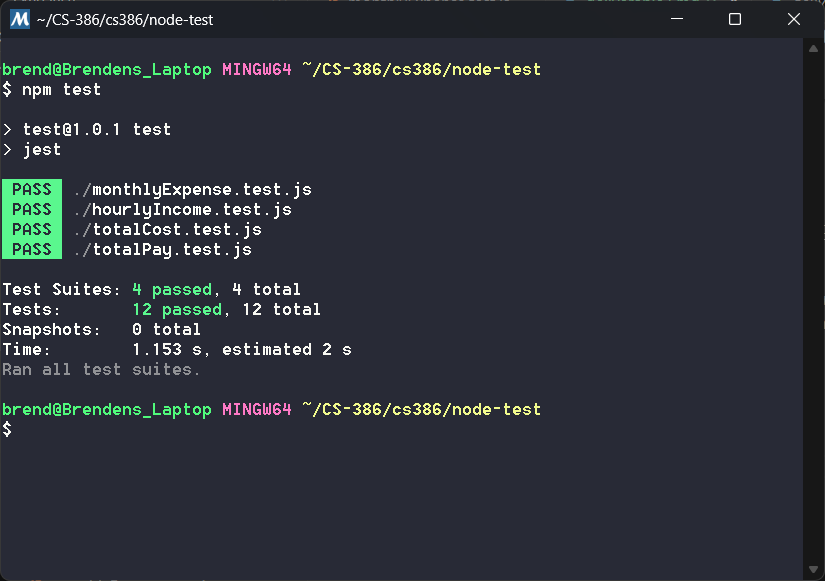

# Deliverable 7

## Description

The problem of poor money management affects young adults and college students; the impact of which is not having enough money for necessities or savings and falling into debt. For young adults and college students who are in debt or have poor money management skills, SimpleCents is a money management website that helps those young adults find ways to manage their finances in order to get rid of debt and start saving. Unlike other budgeting applications, our product offers a signup-free download-free website. SimpleCents is a finance website that helps young adults manage their finances with ease by providing a simple, intuitive budgeting platform that tracks spending and helps them stay on top of their financial goals.

SimpleCents is a website project meant to assist young adults and college students with their spending habits, it also intends to improve their financial literacy. We provide options for our users to visualize their spending habits in a pie chart, compared to their income, we help them visualize their debt and minimum payments necessary towards that debt. We offer information about credit scores and how credit cards work. Our website is a great opportunity for the users to expand on their knowledge and grow a healthy standard for their expenses and money habits.

## Verification

The testing framework that we used is jest, which is a JavaScript Testing Framework that uses node.js. The node_modules are hosted locally because theyre the same no matter the installation, so we dont have the node_modules in our GitHub repository.

Link to tests folder: https://github.com/brenden-matteson/cs386/tree/main/node-test

**Test Case Example 1:**

Link to class: https://github.com/brenden-matteson/cs386/blob/main/SimpleCents/expense-tracker/income.js

This test case tests specifically the monthly class of expenses. Two mock object are created, one with valid values for each expense and the other with an invalid number (negative). The first test checks that the object made from the valid mock object returns the correct total, and the other test checks to make sure that the negative value is not included in the total.

**Test Case Example 2:**

Link to class: https://github.com/brenden-matteson/cs386/blob/main/SimpleCents/expense-tracker/expense.js

This test case tests specifically the hourly class of income. Two tests are used, one creating a mock object with valid inputs for hourlyPay and hoursPerWeek and another test with an invalid input (empty) for the hoursPerWeek. The first test checks that the correct total is calculated and the second test checks that the total is 0 because no pay could be estimated from the invalid input.

**Results**

The other two test suites (totalPay and totalCost) ran are previous tests.

## Acceptance Test

## Validation

