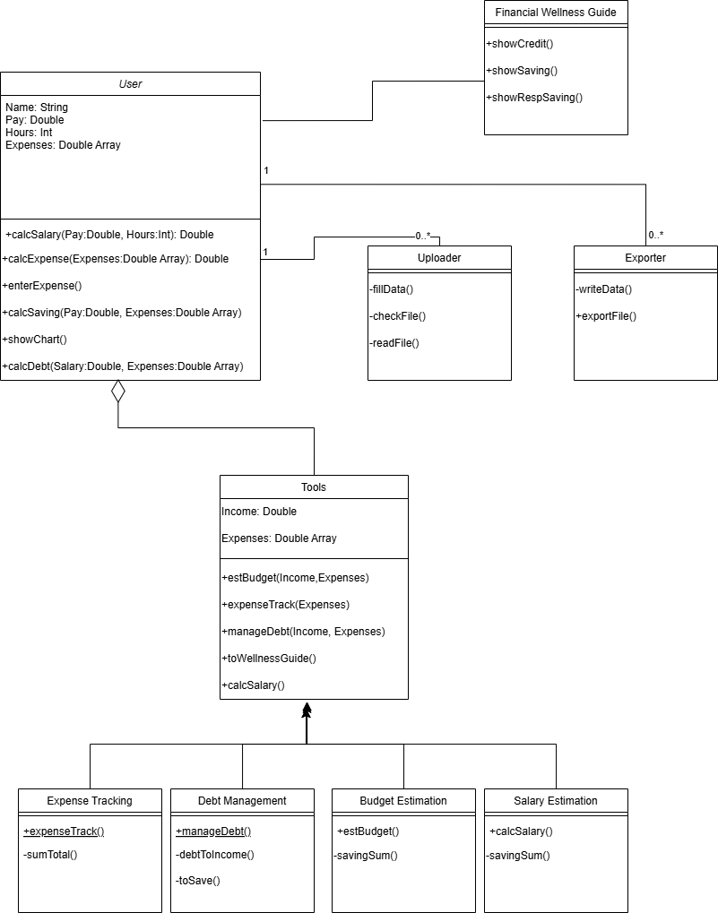

# Deliverable 3: Analysis

## System Description

The problem of poor money management affects young adults and college students; the impact of which is not having enough money for necessities or savings and falling into debt. For young adults and college students who are in debt or have poor money management skills, SimpleCents is a money management website that helps those young adults find ways to manage their finances in order to get rid of debt and start saving. Unlike other budgeting applications, our product offers a signup-free download-free website. SimpleCents is a finance website that helps young adults manage their finances with ease by providing a simple, intuitive budgeting platform that tracks spending and helps them stay on top of their financial goals.

SimpleCents is a financial management web application that is designed to help young adults and college students manage their finances. The system provides users with essential **tools** for budgeting; such as, **tracking expenses**, **budget estimation**, and **debt management**. The web application allows users to manually enter their *income* and *expenses*, categorize their spending, and visualize those expenses and spending through charts. SimpleCents offers recommendations on savings and spending limits by allowing users to set financial goals which helps them make informed decisions about their money. Additionally, the platform supports debt management by allowing users to input *outstanding balances* and *interest rates*, generating minimum payment calculations to help them stay on track.

SimpleCents is intuitive, easy to use, and most importantly, free to use. That’s why we believe that SimpleCents can and should be used by recommendation of employer’s wanting to look out for their employees and as a University resource for students struggling to manage their finances. The SimpleCents web application uses a layered architecture made of **sections** that hold **containers** which contain **objects** for storing information to ensure ease of scalability and maintenance.

SimpleCents also includes a **Financial Wellness Guide** that educates users on topics such as credit building, savings strategies, and responsible spending. The platform also provides an income estimation tool, allowing users to input their *weekly earnings* and *work hours* to **project their annual salary**. SimpleCents also ***exports*** the user’s financial data to a CSV file enabling users to ***upload*** it later to update their budget with new information. This also doubles as a form of login as the data collected is not stored by SimpleCents and user’s can upload their information for ease of use.

## Model

